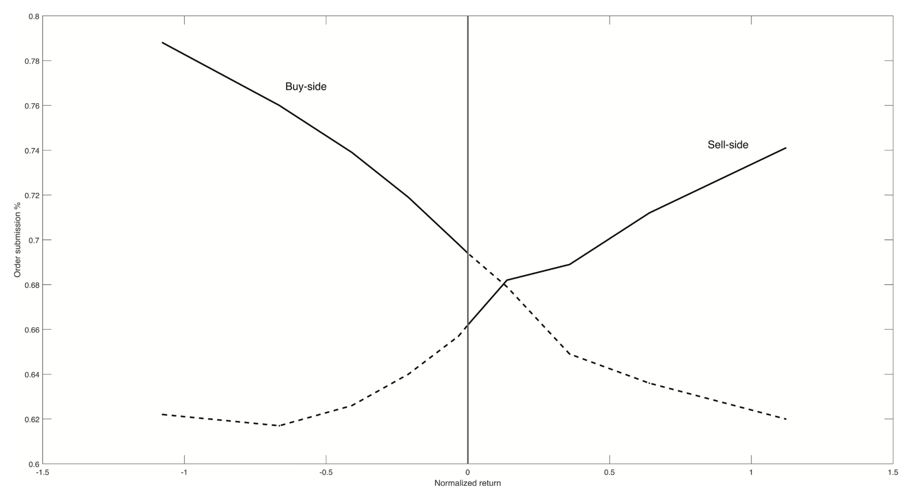

## Highlights

-   Individual investors tend to be uninformed *de facto* market makers.

-   Individual investors provide more liquidity during market declines.

-   Individual liquidity provision can help in improving [market efficiency](https://www.sciencedirect.com/topics/economics-econometrics-and-finance/efficient-market-hypothesis "Learn more about market efficiency from ScienceDirect's AI-generated Topic Pages") when sufficient.

-   Informed liquidity demanders are present.

## Abstract

Using trade-level data from the Taiwan Stock Exchange, we document an asymmetric pattern of liquidity provision by individual investors who serve as *de facto* market makers. Specifically, on average, individual investors provide more liquidity during market declines. We further investigate the impact of asymmetric individual liquidity provision on [market efficiency](https://www.sciencedirect.com/topics/economics-econometrics-and-finance/efficient-market-hypothesis "Learn more about market efficiency from ScienceDirect's AI-generated Topic Pages"). Despite being uninformed, individual investors’ liquidity provision ameliorates market efficiency more during market declines. Our results suggest that individual investors provide liquidity to help those with private information correct prices toward efficient prices, in turn, enhancing market efficiency.

## Keywords

*Liquidity provision, Individual investors, Market efficiency, De facto market makers*

{fig-align="center"}

This figure presents order submission schedule of individual investors across normalized daily returns. Order submission schedule is computed as the fraction of individual trading volume executed by either buy or sell orders to total trading volume.

## Conference

-   International Conference of Taiwan Finance Association (TFA), Taoyuan, Taiwan, Jun 2021 (Online).

-   The Sixth Cross Country Perspective in Finance (CCPF) Symposium.
