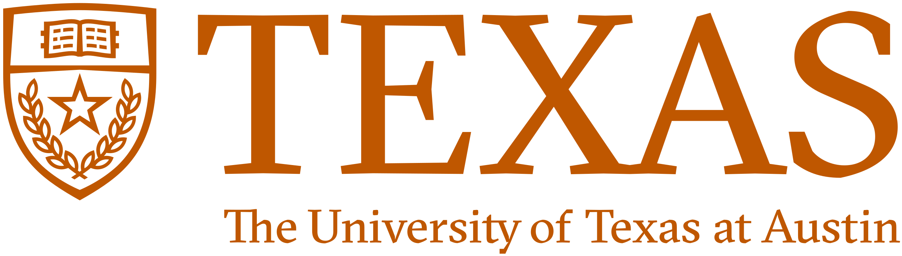

<lord-icon src='https://cdn.lordicon.com/vvyxyrur.json' trigger='loop' delay='1500' colors='primary:#121331,secondary:#3080e8' style='width:60px;height:60px'></lord-icon>

## General

- If students would like to request recommendation letters from me, please read [Recommendation Letter Policy](recommendation.qmd)

## Undergraduate level

- [**Investments**](investments.qmd), National Chengchi University, Spring 2025
- **Financial Management**, National Chengchi University, 2024

## Ph.D. level

- **Seminar on Corporate Finance** (PhD), National Chengchi University, Spring 2025

## Other

- **Textual Analysis and Web Crawling using R** (mini-workshop), National Central University, Fall 2017.

## Teaching Awards & Grants

- Off-Site to UT Austin EMI Professional Development Program \| 2025\
  {width="245" height="69"} {width="98"}
- Excellent Undergraduate English-taught Course Award, NCCU \| 2024
- Professorship Mentor Program, NCCU \| 2024
